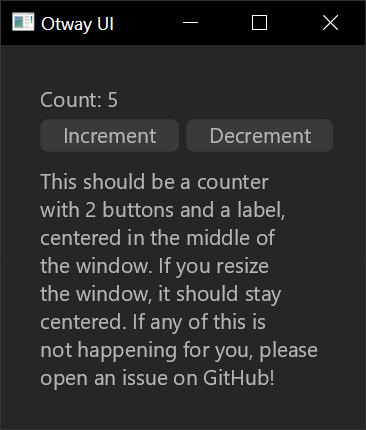

# Otway

### GUI toolkit library which aims to continue the simplicity of Reclutch

## Counter Example



```rust
fn counter(parent: ui::CommonRef, aux: &mut Aux) -> View<AppAux, i32> {
    let mut view = View::new(parent, aux, 0);

    let mut vstack = layout::VStack::new().into_node(None);
    let mut hstack = layout::HStack::new().into_node(None);

    let label = view
        .label(aux)
        .layout(&mut vstack, None)
        .size(42.0)
        .into_inner();

    view.button(aux)
        .text("Increment")
        .layout(&mut hstack, None)
        .press(|view, aux, _| {
            view.set_state(|x| *x += 1);
        });

    view.button(aux)
        .text("Decrement")
        .layout(&mut hstack, None)
        .press(|view, aux, _| {
            view.set_state(|x| *x -= 1);
        });

    vstack.push(hstack, None);
    view.set_layout(vstack);

    view.state_changed(move |view| {
        let count = *view.state();
        view.get_mut(label)
            .unwrap()
            .set_text(format!("Count is up to {}", count));
        layout::update_layout(view);
    });

    view.set_state(|_| {});
    view
}
```

The `.button`/`.label` syntax are simply convenience extensions (which can be written for any custom widget). The general, widget-agnostic syntax is like so;

```rust
// A button that is deleted when clicked.
let btn = view.child(Button::new, aux);
view.on(btn, move |view, aux, event: &PressEvent| {
    view.remove(btn);
});
```

There exists an underlying widget tree in the form of `CommonRef/Common`. Each widget has its own `Common`. The advantage of this secondary reference-based tree hosted/owned by the corresponding widgets of the primary tree is that traversals can go upwards.

### Event Queue Synchronization

Through much exploration, a conclusion was reached wherein some global object is required to synchronize event queues. This idea was simplified further into a global heterogenous queue.
The implementation used is `reclutch-nursery/uniq`, which is a heterogenous adapter on top of `reclutch/event`.

The event handling is closure-based in spite of an event queue.

Given that there is a single queue, out-of-order events are impossible. Further, a thread-safe variant has been implemented, which can be used for multi-threaded UI applications.

### Parallelism

Perhaps in the future, `uniq` may adopt `revenq` as an additional layer of abstraction for `reclutch/event` and subsequently implement parallel updating. Currently the code uses the non-thread-safe variant of the `uniq` structures, however this can easily be changed thanks to the thin wrappers around `uniq` types present in Otway.

There are no plans for moving rendering code to a separate thread, given that `winit` coordinates repaints with the OS (during resizing, etc.) excellently already.
However, at some point, the partial repainting may be implemented if the performance pay-off is big enough.

### `View` or `Widget`?

If you need custom rendering or custom input handling, use `Widget`.

If you want to compose widgets to make a larger UI, use `View`. `View` by itself actually implemented `Widget`, but allows for fully dynamic children.

### `Widget`s have no Middleman

`View`s, by their very nature, simplify creating a UI by acting as a proxy interface, and thus require handles to reference children.

`Widget`s, on the other hand, handle everything themselves. They can access their children directly.

### Layouts

The layout semantics are almost identical to that of Qt's;

```rust
let mut vstack = VStack::new().into_node(None);

vstack.push(&someWidget, None);

parentWidget.set_layout(vstack);
```

### Full and Extensible Theming

Widgets are 100% rendered by themes. Further than that, themes are stringly-typed and composable, meaning you can extend or override any part of an existing theme to also cover your own custom widgets.

### Open-ended Windowing and Rendering

The only standard interface relating to OS interactions is the window event type, which defines events for things such as clicking, typing, cursor movements, etc.

Everything else is up to the implementor; any windowing API can be used and any graphics backend can be used as long as it implements `reclutch::display::GraphicsDisplay`.

## License

Otway is licensed under either

- [Apache 2.0](https://www.apache.org/licenses/LICENSE-2.0)
- [MIT](https://opensource.org/licenses/MIT)

at your choosing.
